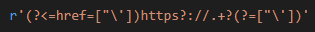

# Compilar e executar:
Para iniciar o programa:
- python3 html.py [endereco de um website web]

# Bibliotecas
- re:  Este módulo fornece operações para correspondência de expressões regulares semelhantes às encontradas em Perl. O nome do módulo vem das iniciais do termo em inglês regular expressions, RE. Regular expressions também são frequentemente chamadas de regex.
- sys: Este módulo fornece acesso a algumas variáveis ​​usadas ou mantidas pelo interpretador e a funções que interagem fortemente com o interpretador.
- requests:  Este módulo permite enviar solicitações HTTP / 1.1 com extrema facilidade. Não há necessidade de adicionar manualmente strings de consulta a seus URLs ou codificar em forma seus dados POST.

# Exemplos de uso: 
Exemplo de uso: Listar todos os links do website: https://moodle.utfpr.edu.br/course/view.php?id=2528

Inicie o codigo
- python3 code.py https://moodle.utfpr.edu.br/course/view.php?id=2528 > resultado.txt

Agora, basta abrir o arquivo resultado.txt, e ver os links da página.

# Expressão regular utilizada:

    

